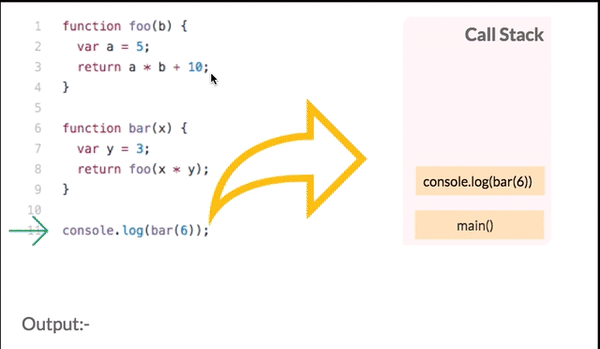
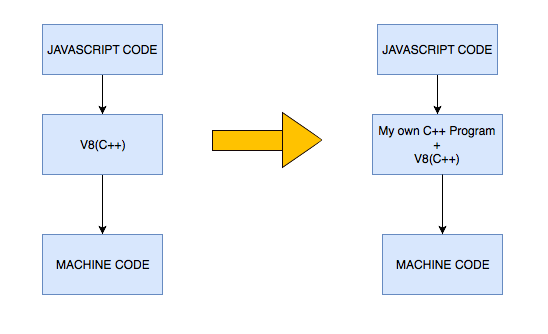

# Event Loop

### Running Project

```
$ METHOD=nested-set-timeout npm run step03
$ METHOD=set-timeout-with-second npm run step03
$ METHOD=set-timeout npm run step03
$ METHOD=set-interval npm run step03
```

### Call Stack

Basically, it is where we are in the program.<br>It is classified as a data structure that records the function calls. <br>
Once we call a function to execute, we push something on to the stack, and when we return from a function, we pop off the top of the stack.
<br>Also important to say that when call stack identify an async code, it removes from the main stack and send it to the event table. 
br

### Message Queue

A JavaScript runtime contains a message queue, which is a list of messages to be processed and the associated callback functions to execute.<br> When the stack has enough capacity, a message is taken out of the queue and processed.<br>
The message processing ends when the stack becomes empty again.

### Job Queue

Reserved only for new Promise() functionality.<br> So when you use promises in your code, you add thenable methods, which are the callback methods.<br>These thenable methods are added to Job Queue, and gets executed once the promise has returned/resolved.

### V8 Engine

It is a Javascript engine, written in c++, developed by Google. <br >Basically, it is a program that converts Javascript code into a lower level or machine code that microprocessors can understand.
- The V8 engine is written in C++ and used in Chrome and Nodejs.
- It implements ECMAScript as specified in ECMA-262.
- The V8 engine can run standalone we can embed it with our own C++ program.



### How is nodejs capable of working like multi thread?
Event loop can be run by different threads, so this was it works like multi thread.

### Set Timeout

Once client set a timeout, it will execute a function at a certain time stipulated by the client. It can be clear by "clearTimeout" function.

*Life cycle of it* -> Once it arrives to "Execution Stack", it goes to "Event Table", as soon as processed, it goes to Event Queue. Once it is ready, it is executed in the stack.

### Set Interval

Once client set an interval, it will continue to exist as a process util it is clear by "clearInterval" function or client current session ends.

Set Interval pass the client code to the STACK in exacted intervals stipulated by them. This means that period of time between each interval will always be the same.
